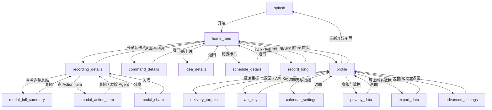

# 页面与交互清单

> **范围**：`index.html` 原型的所有页面（含全屏 screens 和模态框 modals），每个页面包含用途、UI 元素、数据依赖、导航关系与关键交互。
>
> **路由说明**：这是单页 HTML 原型，没有真实路由。所有页面通过 `.screen.active` 类切换显示，模态通过 `.modal-overlay.show` 显示。DOM 锚点列在每个页面的标题里。

---

## 页面总览

| 页面 ID | 中文名 | 类型 | DOM 锚点 | 优先级 |
|---|---|---|---|---|
| `splash` | 启动页 | screen | `#s1` | P0 |
| `home_feed` | 首页 Feed | screen | `#s2` | P0 |
| `recording_details` | 长录音详情 | screen | `#s3` | P0 |
| `command_details` | 指令详情 | screen | `#s4` | P0 |
| `idea_details` | 灵感详情 | screen | `#s5` | P1 |
| `schedule_details` | 日程详情 | screen | `#s6` | P1 |
| `record_long` | 录音中 | screen | `#s7` | P0 |
| `profile` | 个人中心 | screen | `#s10` | P0 |
| `delivery_targets` | 投递目标 | screen | `#s11` | P1 |
| `api_keys` | 自带 API Key | screen | `#s12` | P1 |
| `calendar_settings` | 日历与提醒 | screen | `#s13` | P1 |
| `privacy_data` | 隐私与数据 | screen | `#s14` | P1 |
| `export_data` | 导出所有数据 | screen | `#s15` | P1 |
| `advanced_settings` | 高级设置 | screen | `#s16` | P2 |
| `modal_full_summary` | 完整会议纪要 | modal | `#modal-full-summary` | P0 |
| `modal_action_item` | Action Item 详情 | modal | `#modal-action-item` | P1 |
| `modal_share` | 分享 Sheet | modal | `#modal-share` | P1 |

---

## 1. `splash` — 启动页

- **DOM 锚点**：`#s1`
- **页面用途**：品牌入场 + Onboarding 入口
- **UI 元素**：
  - 戒指大图（`ring.png`）
  - 品牌名"MONOSTONE"
  - Tagline "For your tacit knowledge"
  - "开始"按钮
- **数据依赖**：无（纯静态）
- **导航关系**：
  - **入口**：App 冷启动
  - **出口**：点"开始" → `home_feed`
- **交互点**：
  - 入场动画：戒指图淡入 + 文字逐行上浮
- **备注**：仅前端演示，没有真正的 onboarding flow

---

## 2. `home_feed` — 首页 Feed

- **DOM 锚点**：`#s2`
- **页面用途**：主要工作流中心，展示所有卡片和每日摘要
- **UI 元素**：
  - 顶部 `.home-head`：问候语、第 N 天、戒指连接状态、今日交互次数
  - `.status-line`：6px 青绿色呼吸灯圆点 + 状态文案
  - Filter Chips：全部 / 长录音 / 指令 / 灵感 / 待办
  - 今日速览卡片：节省时间 + 交互来源分布（走路 / 会后 / 电脑前）
  - 卡片列表 `.card`：按时间倒序
    - 长录音卡（`.card.long-rec`）：标题 + 时长 + 参与人数 + pending action count
    - 指令卡（`.card.cmd`）：标题 + 负责人 + 截止
    - 灵感卡（`.card.idea`）：片段 + 创建场景
    - 待办卡（`.card.todo`）：标题 + 截止时间
  - 处理中卡片：`.card.processing`（shimmer 扫光 + "上传中" 类文案）
  - Action Items 区块：内嵌在长录音卡片里，每行带 checkbox
  - FAB（`.fab`）：右下角浮动录音按钮
  - Tab Bar：首页 / 我
- **数据依赖**：
  - `GET /v1/cards?type={filter}` → `Card[]`
  - `GET /v1/digest/today` → `DailySummary`
  - `GET /v1/me` → `User + RingStatus`
  - WebSocket `/v1/recordings/{cardId}/progress` 订阅 processing 状态
- **导航关系**：
  - **入口**：`splash` → "开始"；`profile` → Tab "首页"；`record_long` → 停止/取消
  - **出口**：
    - 点长录音卡 → `recording_details`
    - 点指令卡 → `command_details`
    - 点灵感卡 → `idea_details`
    - 点日程卡 → `schedule_details`
    - 快速点 FAB → `record_long`
    - 点 Tab "我" → `profile`
- **关键交互**：见下方 `#非平凡交互` 小节

---

## 3. `recording_details` — 长录音详情

- **DOM 锚点**：`#s3`
- **页面用途**：查看长录音完整信息
- **UI 元素**：
  - 顶部导航：返回 + 分享按钮
  - 卡片头：标题 + 时长 + 时间 + 参与人头像列表
  - 波形图 `.wave`：10 条竖条律动
  - 结构化摘要区：bullet points + "查看完整总结"链接
  - Action Items 区块（左滑可删除，checkbox 可勾选）
  - 决策区块 `.decisions`：列出本次会议的关键决策
  - Memory Insights 区块 `.memory-row`：本次学到的信息
  - 底部分享按钮
- **数据依赖**：
  - `GET /v1/cards/{cardId}` → `LongRecDetail`
  - `GET /v1/cards/{cardId}/action-items` → `ActionItem[]`
  - `GET /v1/memory/search?source_card_id={cardId}` → `MemoryInsight[]`
  - `GET /v1/cards/{cardId}/full-summary` → `FullSummary`（lazy，点击"查看完整总结"时才 fetch）
- **导航关系**：
  - **入口**：`home_feed` → 点长录音卡片
  - **出口**：
    - 返回 → `home_feed`
    - "查看完整总结" → `modal_full_summary`
    - 点 Action Item → `modal_action_item`
    - "分享" → `modal_share`
- **写入操作**：
  - 左滑 Action Item → `DELETE /v1/action-items/{itemId}`
  - 勾选 Action Item → `PATCH /v1/action-items/{itemId}` status=done

---

## 4. `command_details` — 指令详情

- **DOM 锚点**：`#s4`
- **页面用途**：展示 AI 指令执行结果，支持编辑和发送
- **UI 元素**：
  - 顶部导航：返回
  - 用户原话 `.quote-said`：显示用户说的话
  - Contexts 列表 `.ctx-row`：使用到的上下文，带 ✓ 勾
  - 时间轴 `.timeline`：执行步骤（done / running / pending），running 带脉动圆点
  - 产出预览 `.ef`：邮件主题 + 正文 / 或 loading dots 动画
  - Reclass chips：重新分类为 idea / todo
  - 底部对话输入框（继续追问）
  - 底部按钮组："存草稿" / "发送" 或 "继续后台执行" / "取消"
- **数据依赖**：
  - `GET /v1/cards/{cardId}` → `CommandDetail`
  - WebSocket `/v1/agent/{cardId}/stream` 订阅 processing 状态
- **写入操作**：
  - 发送 → `POST /v1/agent/{cardId}/send`
  - 存草稿 → `POST /v1/agent/{cardId}/save-draft`
  - 追问 → `POST /v1/agent/{cardId}/continue`
  - 重分类 → `PATCH /v1/cards/{cardId}` type=idea|todo
- **导航关系**：
  - **入口**：`home_feed` → 点指令卡片
  - **出口**：返回 → `home_feed`
- **本地状态**：reclass chip 选中、对话输入内容

---

## 5. `idea_details` — 灵感详情

- **DOM 锚点**：`#s5`
- **页面用途**：展示灵感记录及关联项目
- **UI 元素**：
  - 顶部导航：返回
  - 原话引用 `.quote-said`
  - 迷你波形 `.wave-mini` + 时长 `0:08`
  - 创建场景 chip："走路时"
  - 自动归类卡片：项目名 + 置信度百分比
  - 相关灵感列表：其他主题相近的卡片
  - 底部按钮："归档" / "加入项目"
- **数据依赖**：
  - `GET /v1/cards/{cardId}` → `IdeaDetail`
- **写入操作**：
  - 加入项目 → `PATCH /v1/cards/{cardId}` 携带 project 参数
  - 重分类 → `PATCH /v1/cards/{cardId}` type=cmd|todo
- **导航关系**：
  - **入口**：`home_feed` → 点灵感卡片
  - **出口**：返回 → `home_feed`
- **备注**：点击相关灵感可以跳到另一张卡的详情（仅前端演示）

---

## 6. `schedule_details` — 日程详情

- **DOM 锚点**：`#s6`
- **页面用途**：展示待办 / 日程详情
- **UI 元素**：
  - 顶部导航：返回
  - 标题 + 时间 + 地点
  - 来源标签（"30 分钟前捕捉" / "Agent 建议"）
  - 已同步状态：Apple Calendar ✓ / Linear ✓
  - 底部按钮："修改" / "取消" / "完成"
- **数据依赖**：
  - `GET /v1/cards/{cardId}` → `ScheduleDetail`
- **写入操作**：
  - 完成 → `POST /v1/schedules/{cardId}/complete`
  - 修改 → `PATCH /v1/schedules/{cardId}`
  - 取消 → `POST /v1/schedules/{cardId}/cancel`
- **导航关系**：
  - **入口**：`home_feed` → 点待办卡片
  - **出口**：返回 → `home_feed`

---

## 7. `record_long` — 录音中

- **DOM 锚点**：`#s7`
- **页面用途**：实时录音界面
- **UI 元素**：
  - 顶部返回/取消
  - "正在聆听" 状态文案
  - 已加载上下文 chips：当前项目 + 相关人物
  - 实时时长计时器
  - 波形动画
  - 停止按钮（红色大按钮）
- **数据依赖**：
  - `POST /v1/recordings/start` 页面进入时调用
  - WebSocket 上传音频分片
- **写入操作**：
  - 停止 → `POST /v1/recordings/{sessionId}/stop`
  - 取消 → `DELETE /v1/recordings/{sessionId}`
- **导航关系**：
  - **入口**：`home_feed` → FAB 快速点击
  - **出口**：停止 / 取消 → `home_feed`
- **本地状态**：实时计时器、波形动画

---

## 8. `profile` — 个人中心

- **DOM 锚点**：`#s10`
- **页面用途**：用户信息 + 设置入口总览
- **UI 元素**：
  - 用户头像 + 名字 + 订阅 badge（"Max 订阅"）
  - 戒指连接卡片：连接状态 + 电量 + 第 N 天
  - 菜单列表：
    - 投递目标
    - 自带 API Key
    - 日历与提醒
    - 隐私与数据
    - 导出所有数据
    - 高级设置
    - 重新开始引导
    - 退出登录
  - Tab Bar：首页 / 我
- **数据依赖**：
  - `GET /v1/me` → `User + RingStatus`
  - `GET /v1/ring/status`
- **导航关系**：
  - **入口**：`home_feed` → Tab "我"
  - **出口**：
    - 菜单项 → 各子设置页 `s11-s16`
    - Tab "首页" → `home_feed`
    - "重新开始引导" → `splash`
    - "退出登录" → `splash`（原型仅 UI 演示）

---

## 9. `delivery_targets` — 投递目标

- **DOM 锚点**：`#s11`
- **页面用途**：管理 AI 产出的投递目标
- **UI 元素**：
  - 顶部返回
  - 已连接列表：Apple Calendar / Linear / Notion（带 metadata）
  - 可添加列表：Gmail / Obsidian / Google Calendar（灰色"连接"按钮）
- **数据依赖**：
  - `GET /v1/integrations/delivery-targets` → `DeliveryTarget[]`
- **写入操作**：
  - 连接 → `POST /v1/integrations/delivery-targets/{platform}/connect`
  - 断开 → `DELETE /v1/integrations/delivery-targets/{platform}`
- **导航关系**：
  - **入口**：`profile` → "投递目标"
  - **出口**：返回 → `profile`
- **备注**：OAuth 跳转流程仅前端演示

---

## 10. `api_keys` — 自带 API Key

- **DOM 锚点**：`#s12`
- **页面用途**：管理用户自带的 API key 和模型偏好
- **UI 元素**：
  - 顶部返回
  - 已配置 Keys 列表：Anthropic / OpenAI / Gemini
    - masked key
    - 本月用量统计
    - "管理"按钮
  - 默认模型单选列表：Claude Opus 4.6 / GPT-4o / Claude Haiku 4.5
    - 每项带 use_case 说明
- **数据依赖**：
  - `GET /v1/integrations/api-keys` → `APIKeyConfig[] + ModelConfig[]`
- **写入操作**：
  - 添加 key → `POST /v1/integrations/api-keys`
  - 切换模型 → `PATCH /v1/integrations/default-model`
- **导航关系**：
  - **入口**：`profile` → "自带 API Key"
  - **出口**：返回 → `profile`

---

## 11. `calendar_settings` — 日历与提醒

- **DOM 锚点**：`#s13`
- **页面用途**：配置日历同步和提醒策略
- **UI 元素**：
  - 顶部返回
  - 已连接日历列表：Apple Calendar（主日历） / Google Calendar / Outlook
  - 默认写入目标：日历 / 提醒事项（toggle）
  - 提醒策略：
    - 自动提前提醒（toggle）
    - 会议提前 X 分钟（下拉）
    - 待办提前 Y 分钟（下拉）
    - 通勤时间修正（toggle）
- **数据依赖**：
  - `GET /v1/integrations/calendar` → `CalendarConnection[] + ReminderPolicy`
- **写入操作**：
  - 更新策略 → `PATCH /v1/integrations/calendar/reminder-policy`
- **导航关系**：
  - **入口**：`profile` → "日历与提醒"
  - **出口**：返回 → `profile`

---

## 12. `privacy_data` — 隐私与数据

- **DOM 锚点**：`#s14`
- **页面用途**：数据存储和权限管理
- **UI 元素**：
  - 顶部返回
  - 音频存储策略：仅本地 / 云端加密（单选）
  - 数据保留期：30 天 / 90 天 / 永久（单选）
  - 权限列表：麦克风 / 蓝牙 / 位置 / 日历（各带授权状态）
  - 危险操作按钮："删除所有数据并重置"
- **数据依赖**：
  - `GET /v1/privacy/config` → `PrivacyConfig`
- **写入操作**：
  - 更新 → `PATCH /v1/privacy/config`
  - 删除所有 → `DELETE /v1/privacy/all-data`（需要 double-confirm）
- **导航关系**：
  - **入口**：`profile` → "隐私与数据"
  - **出口**：返回 → `profile`

---

## 13. `export_data` — 导出所有数据

- **DOM 锚点**：`#s15`
- **页面用途**：完整 / 按类型导出数据
- **UI 元素**：
  - 顶部返回
  - 完整导出卡片：Markdown / JSON 双按钮 + 总大小"约 1.2 GB"
  - 按类型导出列表：仅长录音 / 仅指令 / 仅灵感
- **数据依赖**：
  - `GET /v1/export/estimates`（估算大小）
- **写入操作**：
  - 触发导出 → `POST /v1/export/request`
  - 查询进度 → `GET /v1/export/{exportId}/status`
- **导航关系**：
  - **入口**：`profile` → "导出所有数据"
  - **出口**：返回 → `profile`

---

## 14. `advanced_settings` — 高级设置

- **DOM 锚点**：`#s16`
- **页面用途**：短录音分类 / 硬件反馈 / 开发者设置
- **UI 元素**：
  - 顶部返回
  - 短录音分类：自动分类 toggle + 低置信度询问 toggle
  - 硬件设置：触觉反馈 toggle + 按住确认时长
  - 开发者：调试日志 toggle + 模拟戒指 toggle + "清除本地缓存"按钮
- **数据依赖**：
  - `GET /v1/settings/advanced` → `AdvancedSettings`
- **写入操作**：
  - 更新 → `PATCH /v1/settings/advanced`
  - 清缓存 → `POST /v1/settings/clear-cache`
- **导航关系**：
  - **入口**：`profile` → "高级设置"
  - **出口**：返回 → `profile`

---

## 15. `modal_full_summary` — 完整会议纪要

- **DOM 锚点**：`#modal-full-summary`
- **类型**：Modal（底部抽屉）
- **页面用途**：查看结构化完整纪要
- **UI 元素**：
  - Header：标题 + ✕ 关闭按钮
  - 内容容器 `.full-summary`：
    - `<h1>` 纪要总标题
    - `.meta-table`：会议时间/时长/参会人员/项目/形式
    - 多个 `<h2>` 章节
    - 章节内含 `<h3>` 子标题、`
` 段落、`<blockquote>` 引用（带 `.bq-author`）、`<ul>`/`<ol>` 列表、`<table>` 数据表格、`<strong>` 加粗
- **数据依赖**：
  - `GET /v1/cards/{cardId}/full-summary` → `FullSummary`
  - 原型里直接读 `FULL_SUMMARIES[cardId]`（hardcode）
- **导航关系**：
  - **入口**：`recording_details` → "查看完整总结"
  - **出口**：✕ 关闭 或 点外层 overlay
- **渲染契约**：
  - 仅 1 个 `<h1>`
  - `<h2>` = `sections[i].h`
  - `<h3>` 在 paragraphs 里以 HTML 块形式出现
  - **禁止跳级**
- **关键函数**：`openFullSummary(cardId)` / `closeModal('modal-full-summary')`

---

## 16. `modal_action_item` — Action Item 详情

- **DOM 锚点**：`#modal-action-item`
- **类型**：Modal
- **页面用途**：查看单条 action item 详情 + Agent 建议
- **UI 元素**：
  - 标题：action item 正文
  - Meta：负责人 + 截止
  - 原话引用：来自哪次会议的哪一段
  - Agent 建议 prompts（3 条按钮）：点击即把 prompt 发给 Agent
- **数据依赖**：
  - `GET /v1/action-items/{itemId}` → `ActionItem`
- **写入操作**：
  - 点建议 → `POST /v1/agent/dispatch`
- **导航关系**：
  - **入口**：`recording_details` → 点 Action Item 文字区域
  - **出口**：✕ 关闭；或点建议后关闭并创建新 cmd 卡片
- **关键函数**：`openActionItem(cardId, itemId)` / `sendToAgent(prompt)`

---

## 17. `modal_share` — 分享 Sheet

- **DOM 锚点**：`#modal-share`
- **类型**：Modal（底部 sheet）
- **页面用途**：选择分享格式和目标
- **UI 元素**：
  - Header：标题 + ✕
  - 预览区：内容摘录
  - 格式选择器：Markdown / PDF / 纯文本
  - 分享目标按钮矩阵：复制 / 邮件 / iMessage / Notion / Slack / 微信 / AirDrop / 文件
- **数据依赖**：
  - `FullSummary` 数据预览（同 modal_full_summary）
- **写入操作**：
  - 触发分享 → `POST /v1/cards/{cardId}/share` + iOS `UIActivityViewController`
- **导航关系**：
  - **入口**：`recording_details` → 底部/右上"分享"按钮
  - **出口**：✕ 或点外层；选中某目标后自动关闭 + toast
- **备注**：原型点击只 toast 反馈；真实实现应 hook iOS share sheet

---

## 页面跳转 Mermaid 图

---

# 非平凡交互清单

> 以下清单供 iOS native 版实现时参考。**平凡交互**（普通按钮点击 / 纯跳转 / 静态 hover）不列。**复杂度**指 iOS 侧实现难度。

## 全局级

### G1. 页面切换过渡
- **位置**：所有 `.screen` 之间
- **触发**：`go(screenId)` 函数切换 `.active` 类
- **效果**：离场 `opacity: 1 → 0` + `translateY(0 → 8px)`；进场反向。持续 350ms，`ease-out`
- **复杂度**：**简单** — SwiftUI `.transition(.opacity.combined(with: .move(edge: .bottom)))` + `.animation(.easeOut(duration: 0.35))`
- **CSS 参考**：第 82-91 行 `.screen` / `.screen.active`

### G2. Toast 弹出
- **位置**：屏幕底部上方 110px 居中
- **触发**：任意操作完成后 `toast('...')` 调用
- **效果**：250ms 淡入 → 停留 2.2s → 250ms 淡出。半透明黑圆角药丸
- **复杂度**：**简单** — `UIView.animate` 或 SwiftUI `.transition(.opacity).animation(.easeInOut(duration: 0.25))` + Timer
- **JS 参考**：`toast()` 函数，第 3577-3589 行

### G3. Tab 栏颜色过渡
- **位置**：底部 Tab Bar
- **触发**：切换 Tab
- **效果**：文字颜色 200ms 平滑渐变 `--text-dimmer ↔ --text`
- **复杂度**：**简单** — SwiftUI `@State` + `.animation(.easeInOut(duration: 0.2))`
- **CSS 参考**：`.tab` 第 119-129 行

---

## 首页 home_feed

### H1. 状态圆点呼吸灯
- **位置**：顶部状态行前的 6px 青绿圆点
- **触发**：页面加载后自动
- **效果**：2s 周期，opacity `1 ↔ 0.3` 循环；带 `0 0 8px rgba(111,212,224,0.6)` 外发光
- **复杂度**：**简单** — SwiftUI `.opacity` + `withAnimation(.easeInOut(duration: 1).repeatForever(autoreverses: true))`
- **CSS 参考**：`.home-head .status-line .dot` + `@keyframes blink`，第 202-207 行

### H2. 卡片骨架屏 Shimmer
- **位置**：`.card.processing` 上的 `::after` 伪元素
- **触发**：卡片状态为 processing 时
- **效果**：宽度 30% 的白光条从 `left: -100%` 平移到 `left: 200%`，周期 2.5s，无限循环
- **复杂度**：**简单** — SwiftUI 自定义 `LinearGradient` + `.offset().animation(.linear.repeatForever())`，或 `CAGradientLayer` + `CABasicAnimation`
- **CSS 参考**：`@keyframes shimmer`，第 341-353 行

### H3. 运行状态脉动点
- **位置**：处理中卡片 meta 区的 `.running-dot`
- **触发**：`processing` 状态
- **效果**：6px 青绿圆点，1.5s 周期呼吸
- **复杂度**：**简单** — 同 H1
- **CSS 参考**：`.running-dot`，第 328-337 行

### H4. Filter Chip 切换
- **位置**：今日速览下方
- **触发**：点击 chip
- **效果**：150ms 内背景 / 边框 / 文字颜色平滑切换；active 态带对应 type 颜色（`--t-rec` / `--t-cmd` / `--t-idea` / `--t-todo`）
- **复杂度**：**简单** — SwiftUI `@State` + `.animation(.easeInOut(duration: 0.15))`
- **CSS 参考**：`.filter-chip`，第 243-275 行

---

## Action Items 区块（首页 + 长录音详情复用）

### A1. 左滑删除（**复杂度最高**）
- **位置**：每个 `.action-row`
- **触发**：手指从右向左滑动 > 100px 并松手
- **效果（分阶段）**：
  1. **手指跟随**：按下时禁用 transition，`.row-inner` 跟随手指 `translateX(dx)`，仅允许负值；若垂直位移 > 10px 则判定为 scroll，退出手势
  2. **松手判断**：如果 dx < -100，触发删除；否则弹回
  3. **滑出**：`transition: transform 0.22s ease-out`，`.row-inner` 一次滑到 `translateX(-420px)` 屏外
  4. **弹回（若未达阈值）**：`transition: transform 0.28s cubic-bezier(0.2,0.8,0.2,1)` 弹回原位
  5. **行塌陷**：滑出后 180ms 触发 `.rejected` 类 → 350ms `@keyframes row-collapse`，`max-height: 80px → 0` + opacity → 0 + padding/margin/border → 0
  6. **Section 折叠（新增）**：若该 sec 内已无可见 action-row，整个 `.sec` 添加 `.collapsing` 类 → 400ms `@keyframes sec-collapse`，连标题一起淡出 + 高度塌陷
- **复杂度**：**复杂**
  - iOS 侧推荐：`UIPanGestureRecognizer` 跟踪 dx → `.changed` 中无动画更新 transform → `.ended` 判断阈值 → `UIViewPropertyAnimator` 或 `CABasicAnimation` 执行滑出 → 然后用 UITableView/UICollectionView 的 `deleteRows` + 自定义动画实现行塌陷 → 最后检查 section 是否空并 `deleteSections`
  - 需要处理 垂直滚动 vs 水平 swipe 的手势冲突（`gestureRecognizerShouldBegin`）
- **关键引用**：
  - JS `setupSwipeRow()` 第 3472-3548 行
  - JS `rejectActionItemBySwipe()` 第 3385-3405 行
  - CSS `.action-row.rejected` + `@keyframes row-collapse`，第 778-797 行
  - CSS `.sec.collapsing` + `@keyframes sec-collapse`，第 788-798 行

### A2. Checkbox 勾选动画
- **位置**：每行 `.action-row .check`
- **触发**：点击 checkbox
- **效果**：
  - 未勾选：6px 半透明边框方框
  - 勾选后：背景变 `--t-todo` 绿、边框同色、中心 ✓（`::after` 伪元素）
  - 文字变删除线 + 颜色降到 `--text-dim`
  - 200ms `transition: all 0.2s`
- **复杂度**：**简单** — SwiftUI `@State` 条件分支 + `.animation(.easeInOut(duration: 0.2))`
- **CSS 参考**：`.action-row .check`，第 799-820 行

---

## FAB 浮动录音按钮

### F1. 长录音脉动（Pulse Ring）
- **位置**：首页右下角 FAB
- **触发**：快速点击（< 300ms 松开）
- **效果**：
  1. 形态：圆形 → 仍为圆形，颜色从青绿变红，内部圆点变 18px 圆角方块
  2. 脉动：外圈 `box-shadow` 从 `0 0 0 0 rgba(255,69,58,0.6)` 扩张到 `0 0 0 16px rgba(255,69,58,0)`，1.4s 周期无限循环
  3. 标签"录音中"从下方 fade in
- **复杂度**：**中等** — `CABasicAnimation` 的 `shadowRadius` / `shadowColor` 配合 keyframe；形态变化用 `UIView.animate` 改 `backgroundColor` / `cornerRadius`
- **CSS 参考**：`.fab.recording-long` + `@keyframes fab-pulse-red`，第 394-410 行

### F2. 短录音按住态
- **位置**：同 FAB
- **触发**：长按 > 300ms
- **效果**：
  - FAB 缩放到 `scale(0.9)`
  - 背景变紫半透，`border-radius: 50% → 18px`（圆变圆角方块）
  - 内圆点变 18px 紫方块
  - 标签变"捕捉中"
- **复杂度**：**中等** — `UILongPressGestureRecognizer` 或 Timer 判断 300ms 阈值；形态变化用 `UIView.animate` 或 SwiftUI `.scaleEffect()`
- **CSS 参考**：`.fab.recording-short`，第 412-424 行
- **JS 参考**：`fabDown()` / `fabUp()` 第 3609-3653 行

### F3. 录音计时器
- **位置**：FAB 下方 `.fab-label`
- **触发**：录音开始后
- **效果**：每 500ms 更新时间文字 "mm:ss"，标签淡入 200ms
- **复杂度**：**简单** — `Timer.publish(every: 0.5)` 或 `CADisplayLink`
- **JS 参考**：`updateRecTimer()` 第 3685-3692 行

---

## 长录音详情 recording_details

### R1. 波形律动
- **位置**：顶部 `.wave`
- **触发**：页面加载后自动
- **效果**：10 条 5px 宽的竖条，高度 `14px ↔ 90px` 循环跳动，周期 1.2s，`ease-in-out`；各条 animation-delay 递增 80ms 形成波浪
- **复杂度**：**简单** — SwiftUI `HStack { ForEach(0..<10) { i in ... .animation(...delay(Double(i) * 0.08))... } }`
- **CSS 参考**：`.wave`，第 1394-1420 行

### R2. 时间轴步骤脉动点
- **位置**：`.timeline .step.running`
- **触发**：步骤状态为 running
- **效果**：紫色圆点，外 `box-shadow` 从 `0 0 0 0` 扩张到 `0 0 0 6px` 再收缩，1.5s 周期
- **复杂度**：**简单** — 同 F1 缩小版
- **CSS 参考**：`@keyframes pulse-dot`，第 1168-1176 行

### R3. 步骤完成状态切换
- **位置**：`.timeline .step.done`
- **触发**：步骤完成
- **效果**：圆点从紫色变灰色，脉动停止
- **复杂度**：**简单**
- **CSS 参考**：第 1165-1167 行

---

## 指令详情 command_details

### C1. Loading Dots 动画
- **位置**：`.result-pending .loading-dots`
- **触发**：命令执行中
- **效果**：三个圆点，opacity `0.3 ↔ 1` 闪烁，延迟 0/200/400ms 形成波浪
- **复杂度**：**简单** — 三个独立的 `.opacity(...)` + 不同 delay
- **CSS 参考**：`@keyframes dots`，第 1227-1240 行

---

## Modal 模态

### M1. 完整总结 / Action Item / Share 的进出场
- **位置**：所有 `.modal-overlay`
- **触发**：`openModal(id)` / `closeModal(id)` 添加/移除 `.show` 类
- **效果**：
  - **背景**：`rgba(0,0,0,0) → rgba(0,0,0,0.6)` + `backdrop-filter: blur(0) → blur(8px)`，250ms
  - **Sheet**：从 `translateY(100%)` 滑入到 `translateY(0)`，350ms，`cubic-bezier(0.2,0.8,0.2,1)`（带弹性）
- **复杂度**：**中等** — iOS 推荐 SwiftUI `.sheet()` 或自定义 `UIPresentationController`；背景模糊用 `UIVisualEffectView(effect: UIBlurEffect())`
- **CSS 参考**：第 573-601 行
- **增强建议**：iOS 侧可以加下拉关闭手势（pull-to-dismiss）

---

## 短录音 / 新卡片入场

### N1. 新卡片状态渐进变化
- **位置**：`home_feed` 顶部
- **触发**：用户完成录音后 `simulateIncomingCard()`
- **效果**：
  - T+0：创建 `.card.processing`，显示 "新录音" + shimmer + "上传中"
  - T+1200ms：文案更新为 "ASR 运行中..."
  - T+2600ms：更新为 "分类中" / "结构化分析中"
  - T+4500ms：移除 `.processing`，卡片最终化为完整内容
- **复杂度**：**简单** — Timer 驱动 `@State` 切换；长录音场景需要搭配 WebSocket 实时消息
- **JS 参考**：`simulateIncomingCard()` 第 3707-3774 行

---

## iOS 实现优先级建议

**必须重点投入**（不是画静态页就能搞定）：
1. **A1 左滑删除 + 行塌陷 + section 塌陷** — 整条链路最复杂，占实现风险 ~40%
2. **F1/F2 FAB 长按/快点两态切换 + 脉动动画** — 状态机 + 协调动画
3. **M1 Modal 从底部滑入 + 背景 blur** — 需要自定义 presentation controller

**可以直接用系统组件**：
- Toast（`UIAlertController` 或轻量库）
- Tab Bar（`UITabBarController` / `TabView`）
- Share sheet（`UIActivityViewController`）

**用 SwiftUI animation 简单搞定**：
- H1/H3/R2 所有呼吸灯、脉动点
- H2/R3 shimmer 和状态切换
- R1 波形律动
- C1 loading dots

**需要额外注意的坑**：
- 手势与滚动冲突识别（`gestureRecognizerShouldBegin`）
- 动画帧率（使用 `CADisplayLink` 或 SwiftUI 新 animation API 而非 `Timer`）
- Modal 的 backdrop blur 在旧设备上需要降级
